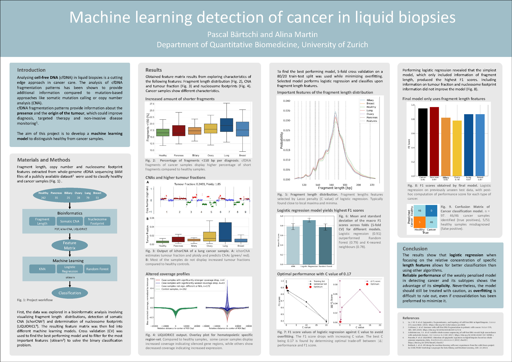

# Semester project: Analysis of cell-free fDNA data with Machine Learning and Bioinformatics tools

### Introduction

Liquid biopsy is an upcoming diagnostic and monitoring tool in cancer care. Whole genome cell-free DNA sequencing allows for the investigation of different features that inform about the presence, type and size of the tumor. Machine learning is increasingly used in the medical domain and can be employed to uncover insightful patterns in the data.

### About
This repository contains the code for the analysis of cfDNA data taken from [Lo et al. (2021)1](https://doi.org/10.1126/science.aaw3616). Results of this project were found by first analyzing cfDNA features such as fragment length, somatic CNAs and the nucleosome footprint in a Bioinformatics workflow to later use Machine Learning to predict tumour type from insights gained. [This poster](https://github.com/pascalbartschi/cfDNA-ML-analysis/blob/main/poster.pdf) summarizes the semester project.

### References
1. Lo, Y. M. D. et al. Epigenetics, fragmentomics , and topology of cell free DNA in liquid biopsies. Science 372 , eaaw3616. (2021). https://doi.org/10.1126/science.aaw3616
2. Cristiano, S. et al. Genome wide cell free DNA fragmentation in patients with cancer. Nature 570 ,385 389 (2019). https://doi.org/10.1038/s41586 019 1272 6
3. Adalsteinsson , V.A. et al. Scalable whole exome sequencing of cell free DNA reveals high concordance with metastatic tumors. Nat Commun 8 , 1324 (2017). https://doi.org/10.1038/s41467017-00965-y
4. Peneder, P. et al. LIQUORICE: detection of epigenetic signatures in liquid biopsies based on whole genome sequencing data, Bioinformatics Advances 2 (2022) vbac017, https://doi.org/10.1093/bioadv/vbac017
5. Buitinck, L. et al. API design for machine learning software: experiences from the scikit learn project. In: ECML PKDD Workshop: Languages for Data Mining and Machine Learning, 108 22 (2013)
